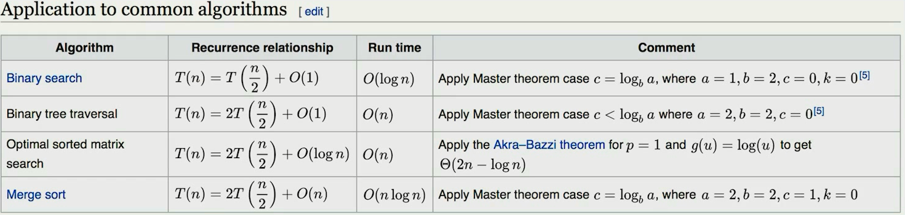

# 基本概念

##  时间复杂度


**主定理**




## 递归

递归需要满足的三个条件

1. 一个问题的解可以分解为几个子问题的解
2. 这个问题与分解后的子问题，除了数据规模不同，求解思路完全一样
3. 存在递归终止条件

**思维要点**

1. 不要人肉进行递归（最大误区）
2. 找到最近最简方法，将其拆解成可重复解决的问题（重复子问题）
3. 

**递归代码需注意的点**

* 警惕堆栈溢出
* 警惕重复计算（可通过散列表解决）

递归代码模版

```java
public void recur(int level, int param) {
    // terminator
    if (level > MAX_LEVEL) {
        // process result
        return;
    }
    
    // process current logic
    process(level, param);
    
    // drill down
    recur(level: level + 1, newParam);
    
    // restore current status
}
```

**DFS(深度优先)**

二叉树

```java
Set<TreeNode> visited = new HashSet<>();
public void dfs(TreeNode node) {
    if (visited.contains(node))
        // already visited
    	return;
    visited.add(node);

    // process current node
    // ... logic here
    dfs(node.left);
    dfs(node.right);
}
```

多叉树/图

```python
visited = set()
def dfs(node):
    if node in visited:
		# already visited
		return
	visited.add(node)
    # process current node here
    ...
    for next_node in node.childres():
        if not next_node in visited:
            dfs(next_node, visted)
```

 **BFS(广度优先)**

  ```python
def BFS(graph, start, end):
    queue = []
    queue.appent([start])
    visited.add(start)
    
    while queue:
        node = queue.pop()
        visited.add(node)
        
        process(node)
        nodes = genetate_related_nodes(node)
        queue.push(nodes)
        
    # other processint work
    ...
  ```

## 贪心算法 Greedy

贪心算法是一种在每一步选择中都选择在当前状态下最好或最优（即最有利）的选择，从二希望导致结果是全局最好活最优的算法。

贪心算法与动态规划的不同在于它对每个子问题的解决方案都做出选择，不能回退。动态规划则会保存以前的运算结果，并根据以前的结果对当前进行选择，有回退功能。

适用贪心算法的场景：问题能够分解成子问题,子问题的最优解能递推到最终问题的最优解。这种子问题最优解称为最优子结构。

> 贪心：当下做局部最优判断
>
> 回溯：能够回退
>
> 动态规划:最优判断+回退

 


参考链接：

* [https://www.bigocheatsheet.com/](https://www.bigocheatsheet.com/)
* 

