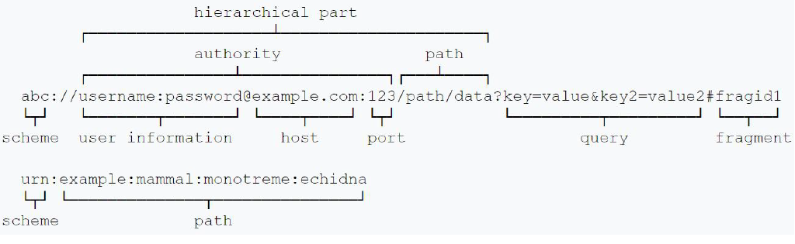
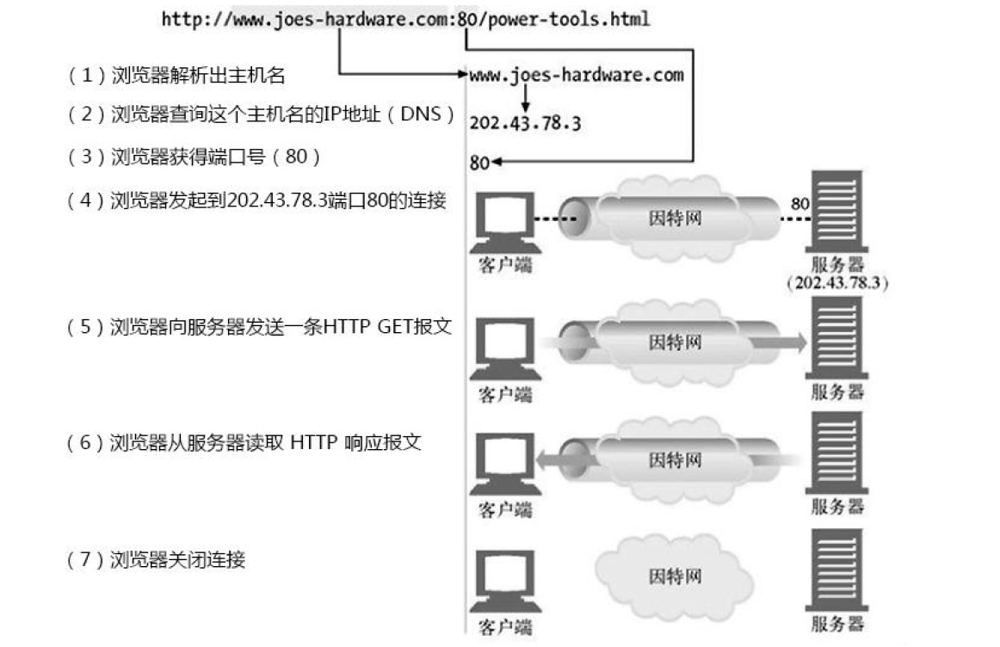
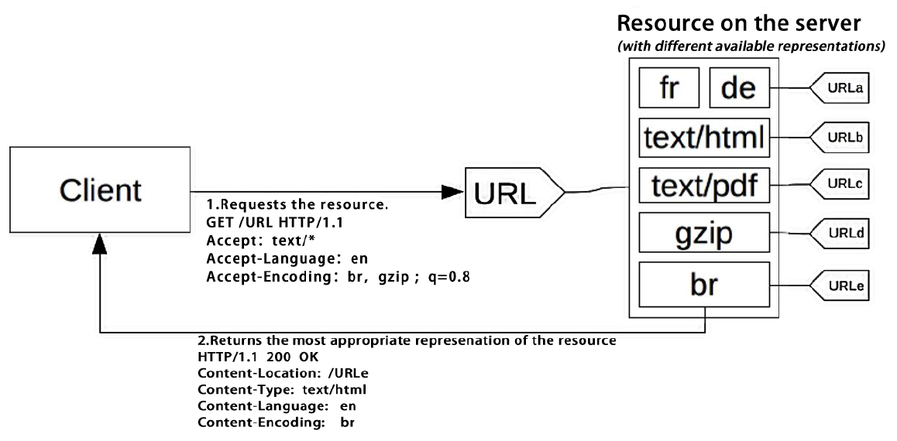

# HTTP 协议

> Web's major goal was to be a shared information space through which people and machines could communicate.		-- Berners-Lee

## HTTP  协议相关概念

**HTTP 协议(HyperText Transfer Protocol)**：一种无状态的、应用层的、以请求/应答方式运行的协议，它使用可扩展的语义和自描述消息格式，与基于网络的超文本信息系统灵活的互动。

> RFC7230
>  The Hypertext Transfer Protocol (HTTP) is a stateless application-level protocol for distributed, collaborative, hypertext information systems.  

超文本传输协议，从名字可以看出，它由 超文本、传输、协议三部分组成。

* 协议：HTTP 是一个用在计算机世界里的协议。它使用计算机能够理解的语言确立了一种计算机之间交流通信的规范，以及相关的各种控制和错误处理方式。

* 传输：HTTP 是一个在计算机世界里专门用来在两点之间传输数据的约定和规范。

  > 1、HTTP协议是一个“双向协议”
  >
  > 2、不限定两个角色，允许有中转或接力A<=>X<=>Y<=>Z<=>B

* 超文本：就是“超越了普通文本的文本”，它是文字、图片、音频和视频等的混合体，最关键的是含有“超链接”，能够从一个“超文本”跳跃到另一个“超文本”，形成复杂的非线性、网状的结构关系。

  > 所谓“文本”（Text），就表示 HTTP 传输的不是 TCP/UDP 这些底层协议里被切分的杂乱无章的二进制包（datagram），而是完整的、有意义的数据，可以被浏览器、服务器这样的上层应用程序处理。

**HTTP 解决了什么问题？**

解决 www 信息交互必须面对的需求：

* 低门槛
* 可扩展性：巨大的用户群体，超长的寿命
* 分布式系统下的 Hypermedia：处理大数据的网络传输
* Internet 规模
  * 无法控制的 scalability
    * 不可预测的负载、非法格式的数据、恶意消息
    * 客户端不能保持所有服务器的消息，服务器不能保持多个请求间的状态信息
  * 独立的组建部署：新老组件并存
* 向前兼容：自 1992 年起 HTTP0.9\1.0（1996）已经被广泛的使用

**HTTP 是一个在计算机世界里专门在两点之间传输文字、图片、音频、视频等超文本数据的约定和规范。**

**URI/URL**：

URI（Uniform Resource Identifier），中文名称是 统一资源标识符，使用它就能够唯一地标记互联网上资源。

URI的基本组成部分：协议名，主机名，路径。

> http://   nginx.org   /en/download.html
>
> 协议名  主机名         路径

URI 另一个更常用的表现形式是 URL（Uniform Resource Locator）， 统一资源定位符，也就是我们俗称的“网址”，它实际上是 URI 的一个子集，差异不大，所以通常不会做严格的区分。

## HTTP 协议格式

HTTP的核心是：它传输的报文内容

### 报文结构

TCP 报文有 20 字节的头部数据，存储 TCP 协议必须的额外信息，例如发送方的端口、接受方的端口、包序号、标志位等等


HTTP 协议的请求报文和响应报文的结构基本相同，由三大部分组成：

1. 起始行（start line）：描述请求或响应的基本信息；
2. 头部字段集合（header）：使用 key-value 形式更详细地说明报文；
3. 消息正文（entity）：实际传输的数据，它不一定是纯文本，可以是图片、视频等二进制数据。

这其中起始行和头部字段经常又称为 **请求头** 或 **响应头**，消息正文又称为**实体**(很多时候直接称为 **body**)

HTTP 协议规定报文必须有 header，但可以没有 body，而且在 header 之后必须要有一个“空行”，也就是“CRLF”，十六进制的“0D0A”。一个完整的 HTTP 报文如下图所示：


### 请求行

**请求行(request line)**：简要地描述了客户端想要如何操作服务器端的资源。

请求行由三部分构成：

1. 请求方法：是一个动词，如 GET/POST，表示对资源的操作；
2. 请求目标：通常是一个 URI，标记了请求方法要操作的资源；
3. 版本号：表示报文使用的 HTTP 协议版本。

这三个部分通常使用空格（space）来分隔，最后要用 CRLF 换行表示结束。


Wireshark 抓包的请求行为

```
GET / HTTP/1.1
```

> “GET”是请求方法，“/”是请求目标，“HTTP/1.1”是版本号

#### 请求方法

HTTP 的报文结构，由 header + body 构成，请求头里有请求方法和请求目标，响应头里有状态码和原因短语。

**标准请求方法**(RFC7231)

目前 HTTP/1.1 规定了八种方法，单词都必须是大写的形式

* GET：可以理解为读取或者下载数据；主要的获取信息方法，大量的性能优化都针对该方法；幂等方法
* HEAD：类似 GET 方法，但服务器不发送 BODY，用以获取 HEAD 元数据；幂等方法
* POST：向资源提交数据，相当于写入或上传数据；通常 POST 表示的是“新建”“create”的含义
* PUT：类似 POST；通常 PUT 则是“修改”“update”的含义；幂等方法
* DELETE：删除资源；幂等方法
* CONNECT：建立特殊的连接隧道；
* OPTIONS：显示服务器对访问资源支持的方法，在响应头的 Allow 字段里返回；幂等方法 (跨域)
* TRACE：追踪请求 - 响应的传输路径。回显服务器收到的请求，用于定位问题。有安全风险


这些操作类似与数据库的“增删改查”，只不过操作的目标不是本地资源，而是远程服务器上的资源。

> 增：POST;； 删：DELETE ； 改：PUT； 查：GET

**安全**：是指请求的方法不会“破坏”服务器上的资源，即不会对服务器上的资源造成实质的修改。

> 只有 GET 和 HEAD 方法是 “安全“的，因为他们是 ”只读“操作，只要服务器不故意曲解请求方法的处理方式，无论 GET 和 HEAD 操作多少次，服务器上的数据都是“安全的”。
>
> 而 POST/PUT/DELETE 操作会修改服务器上的资源，增加或删除数据，所以是“不安全”的。

**幂等**：多次执行相同的操作，结果都是相同的，即多次”幂“后结果”相等“

> GET 和 HEAD 既是安全的也是幂等的，DELETE 可以多次删除同一个资源，效果都是“资源不存在”，所以也是幂等的。
>
> 按照 RFC 里的语义，POST 是“新增或提交数据”，多次提交数据会创建多个资源，所以不是幂等的；而 PUT 是“替换或更新数据”，多次更新一个资源，资源还是会第一次更新的状态，所以是幂等的。

用于文档管理的 WEBDAV 方法(RFC2518)

• PROPFIND：从 Web 资源中检索以 XML 格式存储的属性。它也被重载，以允许一个检索远程系统的集合结构（也叫目录层次结构）
• PROPPATCH：在单个原子性动作中更改和删除资源的多个属性
• MKCOL：创建集合或者目录
• COPY：将资源从一个 URI 复制到另一个 URI
• MOVE：将资源从一个 URI 移动到另一个 URI
• LOCK：锁定一个资源。WebDAV 支持共享锁和互斥锁。
• UNLOCK：解除资源的锁定

### 响应行

**响应行/状态行(status line)**：意思是服务器响应的状态。

> 响应报文里的起始行。

也由三部分组成

1. 版本号：表示报文使用的 HTTP 协议版本，通常是 HTTP/1.1
2. 状态码：一个三位数，用代码的形式表示处理的结果，比如 200 是成功，500 是服务器错误；
3. 原因：作为数字状态码补充，是更详细的解释文字，帮助人理解原因。


Wireshark 抓包案例：

```
HTTP/1.1 200 OK
```

#### 响应状态码

> 响应码规范：RFC6585 （2012.4）、RFC7231 （2014.6）

状态码是一个十进制数字，代表服务器对请求的处理结果。

> “状态码”而不是“错误码”。也就是说，它的含义不仅是错误，更重要的意义在于表达 HTTP 数据处理的“状态

目前 RFC 标准里规定的状态码是三位数，所以取值范围就是从 000 到 999。目前 RFC 标准里总共有 41 个状态码，但状态码的定义是开放的，允许自行扩展。

RFC 标准把状态码分成了五类，用数字的第一位表示分类，而 0~99 不用，这样状态码的实际可用范围就大大缩小了，由 000~999 变成了 100~599。

这五类的具体含义是：

* 1××：请求已接收到，需要进一步处理才能完成，HTTP1.0 不支持

  * 100 Continue：上传大文件前使用，由客户端发起请求中携带 Expect: 100-continue 头部触发

  * 101 Switch Protocols：协议升级使用,由客户端发起请求中携带 Upgrade: 头部触发，如升级 websocket 或者 http/2.0

  * 102 Processing：WebDAV 请求可能包含许多涉及文件操作的子请求，需要很长时间才能完成请求。该代码表示 服务器已经收到并正在处理请求，但无响应可用。这样可以防止客户端超时，并假设请求丢失

* 2××：报文已经收到并成功处理请求

  * 200 OK：是最常见的成功状态码，表示成功返回响应。

  * 201 Created: 有新资源在服务器端被成功创建

  * 202 Accepted: 服务器接收并开始处理请求，但请求未处理完成。这样一个模糊的概念是有意如此设计，可以覆盖更多的场景。例如异步、需要长时间处理的任务。

  * 203 Non-Authoritative Information：当代理服务器修改了 origin server 的原始响应包体时（例如更换了HTML中的元素值），代理服务器可以通过修改
    200为203的方式告知客户端这一事实，方便客户端为这一行为作出相应的处理。203响应可以被缓存。
  * 204 No Content：含义与“200 OK”基本相同，成功执行了请求且不携带响应包体，并暗示客户端无需更新当前的页面视图
  * 205 Reset Content：成功执行了请求且不携带响应包体，同时指明客户端需要更新当前页面视图。
  * 206 Partial Content：是 HTTP 分块下载或断点续传的基础，在客户端发送“范围请求”、要求获取资源的部分数据时出现，它与 200 一样，也是服务器成功处理了请求，但 body 里的数据不是资源的全部，而是其中的一部分。状态码 206 通常还会伴随着头字段“Content-Range”，表示响应报文里 body 数据的具体范围，供客户端确认，例如“Content-Range: bytes 0-99/2000”，意思是此次获取的是总计 2000 个字节的前 100 个字节。
  * 207 Multi-Status：RFC4918 ，在 WEBDAV 协议中以 XML 返回多个资源的状态。
  * 208 Already Reported：RFC5842 ，为避免相同集合下资源在207响应码下重复上报，使用 208 可以使用父集合的响应码。

* 3××：重定向，资源位置发生变动，需要客户端重新发送请求；重定向使用 Location 指向的资源或者缓存中的资源。在 RFC2068
  中规定客户端重定向次数不应超过 5 次，以防止死循环。

  * 300 Multiple Choices：资源有多种表述，通过 300 返回给客户端后由其自行选择访问哪一种表述。由于缺乏明确的细节，300 很少使用。
  * 301 Moved Permanently：俗称“永久重定向”，此次请求的资源已经不存在了，需要改用新的 URI 再次访问。资源永久性的重定向到另一个 URI 中。
  * 302 Found：俗称“临时重定向”（Moved Temporarily）资源临时的重定向到另一个 URI 中。
  * 303 See Other：重定向到其他资源，常用于 POST/PUT 等方法的响应中。
  * 304 Not Modified： 用于 If-Modified-Since 等条件请求，表示资源未修改，用于缓存控制。当客户端拥有可能过期的缓存时，会携带缓存的标识
  etag、时间等信息询问服务器缓存是否仍可复用，而304是告诉客户端可以
    复用缓存。
  * 307 Temporary Redirect：类似302，但明确重定向后请求方法必须与原请求方法相同，不得改变。
  * 308 Permanent Redirect：类似301，但明确重定向后请求方法必须与原请求方法相同，不得改变。
  
* 4××：客户端错误，请求报文有误，服务器无法处理；
  * **400 Bad Request**：服务器认为客户端出现了错误，但不能明确判断为以下哪种错误时使用此错误码。例如HTTP请求格式错误。
  * 401 Unauthorized：用户认证信息缺失或者不正确，导致服务器无法处理请求。
  * 407 Proxy Authentication Required：对需要经由代理的请求，认证信息未通过代理服务器的验证
  * **403 Forbidden**：服务器理解请求的含义，但没有权限执行此请求
  * **404 Not Found**：服务器没有找到对应的资源
  * 410 Gone：服务器没有找到对应的资源，且明确的知道该位置永久性找不到该资源
  * 405 Method Not Allowed：服务器不支持请求行中的 method 方法
  * 406 Not Acceptable：对客户端指定的资源表述不存在（例如对语言或者编码有要求），服务器返回表述列表供客户端选择。
  * 408 Request Timeout：服务器接收请求超时
  * 409 Conflict：资源冲突，例如上传文件时目标位置已经存在版本更新的资源
  * 411 Length Required：如果请求含有包体且未携带 Content-Length 头部，且不属于chunk类请求时，返回 411
  * 412 Precondition Failed：复用缓存时传递的 If-Unmodified-Since 或 If-None-Match 头部不被满足
  * 413 Payload Too Large/Request Entity Too Large：请求的包体超出服务器能处理的最大长度
  * **414 URI Too Long**：请求的 URI 超出服务器能接受的最大长度
  * 415 Unsupported Media Type：上传的文件类型不被服务器支持
  * 416 Range Not Satisfiable：无法提供 Range 请求中指定的那段包体
  * 417 Expectation Failed：对于 Expect 请求头部期待的情况无法满足时的响应码
  * 421 Misdirected Request：服务器认为这个请求不该发给它，因为它没有能力处理。
  * 426 Upgrade Required：服务器拒绝基于当前 HTTP 协议提供服务，通过Upgrade 头部告知客户端必须升级协议才能继续处理。
  * 428 Precondition Required：用户请求中缺失了条件类头部，例如 If-Match
  * 429 Too Many Requests：客户端发送请求的速率过快，（一般不会返回429，而返回503）
  * 431 Request Header Fields Too Large：请求的 HEADER 头部大小超过限制
  * 451 Unavailable For Legal Reasons：RFC7725 ，由于法律原因资源不可访问
  
* 5××：服务器错误，服务器在处理请求时内部发生了错误。
* 500 Internal Server Error：服务器内部错误，且不属于以下错误类型
  * 501 Not Implemented：服务器不支持实现请求所需要的功能
  * 501 Not Implemented：服务器不支持实现请求所需要的功能
  * 503 Service Unavailable：服务器资源尚未准备好处理当前请求
  * **504 Gateway Timeout**：代理服务器无法及时的从上游获得响应
  * 505 HTTP Version Not Supported：请求使用的 HTTP 协议版本不支持
  * 507 Insufficient Storage：服务器没有足够的空间处理请求
  * 508 Loop Detected：访问资源时检测到循环
  * 511 Network Authentication Required：代理服务器发现客户端需要进行身份验证才能获得网络访问权限

其中1xx、2xx、3xx 为成功响应吗，4xx、5xx 为失败响应码。

此外当客户端接受到它不认识的响应码时，将按照该响应吗所在系列的第一个响应码(x00)来处理

> 如客户端收到：577 将会以 500 来处理，其他类似

### 头部字段

请求行或状态行再加上头部字段集合就构成了 HTTP 报文里完整的请求头或响应头。

头部字段是 key-value 的形式，key 和 value 之间用“:”分隔，最后用 CRLF 换行表示字段结束。

HTTP 头字段非常灵活，不仅可以使用标准里的 Host、Connection 等已有头，也可以任意添加自定义头。

> **注意**：
>
> 1. 字段名不区分大小写
> 2. 字段名里不允许出现空格，可以使用连字符“-”，但不能使用下划线“_”。
> 3. 字段名后面必须紧接着“:”，不能有空格，而“:”后的字段值前可以有多个空格；
> 4. 字段的顺序是没有意义的，可以任意排列不影响语义；
> 5. 字段原则上不能重复，除非这个字段本身的语义允许，例如 Set-Cookie。

**请求头字段**

HTTP 协议规定了非常多的头部字段，实现各种各样的功能，但基本上可以分为四大类：

1. 通用字段：在请求头和响应头里都可以出现；
2. 请求字段：仅能出现在请求头里，进一步说明请求信息或者额外的附加条件；
3. 响应字段：仅能出现在响应头里，补充说明响应报文的信息；
4. 实体字段：它实际上属于通用字段，但专门描述 body 的额外信息。

### URL&URI

什么事URI

* **URL**：RFC1738(1994.12)，Uniform Resource Locator，表示资源的位置，期望提供查找资源的方法。
* **URN**：RFC2141(1997.5)，Uniform Resource Name，期望为资源提供持久的、位置无关的表示方法，并充分地将多个命名空间映射到单个URN命名空间。
* **URI**：RFC1630 （1994.6）、RFC3986 （2005.1，取代 RFC2396 和 RFC2732 ），Uniform Resource Identifier，用以区分资源，是 URL 和 URN
  的超集，用以取代 URL 和 URN 概念

Resource资源

* 可以是图片、文档等，也可以是不能通过互联网访问的实体，例如人、公司、实体书，也可以是抽象的概念，例如亲属关系或者数字符号
* 一个资源可以有多个 URI

Identifier标识符

* 将资源与其他资源区分开的名称

Uniform 统一

* 允许不同种类的资源在同一上下文中出现
* 对不同种类的资源标识符可以使用同一种语义进行解读
* 引入新的标识符时，不会对已有标识符产生影响
* 允许同一资源标识符在不同的、internet 规模的上下文中出现

URI 的组成schema, user information, host, port, path, query, fragment



* **scheme（方案名或协议名）**：表示资源应该使用哪种协议来访问。
* **://**：scheme 之后，必须的三个特定的字符，它把 scheme 和后面的部分分离开
* **authority**：
  * **user information**：表示登录主机时的用户名和密码，但现在已经不推荐使用这种形式了（RFC7230）
  * **host**: 表示资源所在的主机名，通常的形式是 host:post，即主机名加端口号。
  * **port**：端口号有时可以省略，浏览器等客户端会依据 scheme 使用默认的端口号，例如 HTTP 的默认端口号是 80，HTTPS 的默认端口号是 443。
* **path**：标记资源所在位置的 Path，URI 的 path 部分必须以“/”开始，也就是必须包含“/”，
* **query**:表示对资源附加的额外要求；在 path 之后，用一个“?”开始，但不包含“?”，表示对资源附加的额外要求。查询参数 query 有一套自己的格式，是多个“key=value”的字符串，这些 KV 值用字符“&”连接，浏览器和服务器都可以按照这个格式把长串的查询参数解析成可理解的字典或关联数组形式。
* **fragment**：片段标识符，URI 所定位的资源内部的一个“锚点”或者说是“标签”，浏览器可以在获取资源后直接跳转到它指示的位置。

URI ABNF 定义


#### **URI 编码**

**为什么要进行 URI 编码？**

* 传递数据中，如果存在用作分隔符的保留字符该怎么解析？
* 对可能产生歧义性的数据编码
  * 不在 ASCII 码范围内的字符
  * ASCII 码中不可显示的字符
  * URI 中规定的保留字符
  * 不安全的字符（传输环节中可能被不正确处理），如空格、引号、尖括号等

> URI 中的保留字符：reserved = gen-delims / sub-delims
>
> * gen-delims = ":" / "/" / "?" / "#" / "[" / "]" / "@"
> * sub-delims = "!" / "$" / "&" / "'" / "(" / ")" / "*" / "+" / "," / ";" / "="
>
> 非保留字符：unreserved = ALPHA / DIGIT / "-" / "." / "_" / "~"
>
> * ALPHA: %41-%5A and %61-%7A
> * DIGIT: %30-%39
> * `-: %2D .: %2E _: %5F`
> * ~: %7E，某些实现将其认为保留字符

**如何进行编码？**

URI 里只能使用 ASCII 码，编码直接把非 ASCII 码或特殊字符转换成十六进制字节值，然后前面再加上一个“%”。

非ASCII码字符(例如中文)：建议先 UTF8 编码，在 US-ASCII 编码

对URI合法字符，编码与不编码是等价的。

### HTTP 头部解析

> 客户端与服务器建立 HTTP 连接的常见流程



#### Connection 头部 (短链接与长连接)

Connection 头部

* Keep-Alive：客户端在请求头携带 Connection：Keep-Alive，表示客户端请求建立长连接; 服务端回复的响应头携带  Connection：Keep-Alive，表示服务器支持长连接

* Close：短链接

对代理服务器的要求：不转发 Connection 列出的头部，Connection 仅针对当前连接有效


代理服务器处理请求头中的 Connection 时，陈旧的代理服务器不识别该头部：退化为短连接，新版本的代理服务器理解该头部，与客户端建立长连接，与服务器使用 Connection 替代 Proxy-Connect 头部。

#### Host 头部

HTTP 1.0 中没有Host头部，HTTP1.0 所处的时代，域名相对较少，每一个服务器的IP地址仅对一个域名，当客户端与服务端建立连接后不需要考虑匹配每个域名对应服。但后IP地址(IPv4)不够用了，域名相对较多，因此HTTP1.1中引入了Host头部。

Host = uri-host [ ":" port ]

* HTTP/1.1 规范要求，不传递 Host 头部则返回 400 错误响应码

* 为防止陈旧的代理服务器，发向正向代理的请求 request-target 必须以absolute-form 形式出现

  request-line = method SP request-target SP HTTP-version CRLF

  absolute-form = absolute-URI

  *  absolute-URI = scheme ":" hier-part [ "?" query


服务器接受到连接请求后，对HTTP消息路由和处理的常规流程。

1. 建立 TCP 连接，确定服务器的 IP 地址
2. 接收请求
3. 寻找虚拟主机，匹配Host头部与域名
4. 寻找 URI 的处理代码，匹配 URI
5. 执行处理请求的代码，访问资源
6. 生成HTTP响应，各中间件基于PF架构串行修改响应
7. 发送HTTP响应
8. 记录访问日志

#### HTTP 请求上下文相关的头部

##### 请求上下文

**User-Agent**：指明客户端的类型信息，服务器可以据此对资源的表述做抉择

* User-Agent = product *( RWS ( product / comment ) )
  * product = token ["/" product-version]
  * RWS = 1*( SP / HTAB ) 

> 示例：
>
> * User-Agent: Mozilla/5.0 (Windows NT 10.0; Win64; x64) AppleWebKit/537.36 (KHTML, like Gecko) Chrome/88.0.4324.104 Safari/537.36

**Referer**:浏览器对来自某一页面的请求自动添加的头部

* Referer = absolute-URI / partial-URI

Referer 不会被添加的场景

* 来源页面采用的协议为表示本地文件的 "file" 或者 "data" URI
* 当前请求页面采用的是 http 协议，而来源页面采用的是 https 协议

Referer 的用途：服务器端常用于统计分析、缓存优化、防盗链等功能

**From**：主要用于网络爬虫，告诉服务器如何通过邮件联系到爬虫的负责人

* From = mailbox

  示例：From: webxiaoming@example.org

##### 响应上下文

**Server**：指明服务器上所用软件的信息，用于帮助客户端定位问题或者统计数据

* Server = product *( RWS ( product / comment ) )

  * product = token ["/" product-version]

  示例：Server: nginx、Server: openresty/1.13.6.2

**Allow**：告诉客户端，服务器上该 URI 对应的资源允许哪些方法的执行

* Allow = #method

  示例：Allow: GET, HEAD, PUT

**Accept-Ranges**：告诉客户端服务器上该资源是否允许 range 请求

* Accept-Ranges = acceptable-ranges

  示例：Accept-Ranges: bytes 表示接受 Range请求、Accept-Ranges: none 表示不接受 range 请求

### 内容协商

每个 URI 指向的资源可以是任何事物，可以有多种不同的表述，例如一份文档可以有不同语言的翻译、不同的媒体格式、可以针对不同的浏览器提供不同的压缩编码等。

内容协商的两种方式:

* Proactive 主动式内容协商：指由客户端先在请求头部中提出需要的表述形式，而服务器根据这些请求头部提供特定的 representation 表述

  

  

* Reactive 响应式内容协商：指服务器返回 300 Multiple Choices 或者 406 Not Acceptable，由客户端选择一种表述 URI 使用

  

**常见的协商要素**

* 质量因子 q：内容的质量、可接受类型的优先级
* 媒体资源的 MIME 类型及质量因子
  * Accept: text/html,application/xhtml+xml,application/xml;q=0.9,*/*;q=0.8
  * Accept:text/html,application/xhtml+xml,application/xml;q=0.9,image/webp,image/apng,*/*;q=0.8,application/signed-exchange;v=b3
* 字符编码：由于 UTF-8 格式广为使用， Accept-Charset 已被废弃 
  * Accept-Charset: ISO-8859-1,utf-8;q=0.7,*;q=0.7
* 内容编码：主要指压缩算法
  * Accept-Encoding: gzip, deflate, br
* 表述语言, （q 表示优先级）
  * Accept-Language: zh-CN,zh;q=0.9,en-US;q=0.8,en;q=0.7
  * Accept-Language: zh-CN,zh;q=0.8,zh-TW;q=0.7,zh-HK;q=0.5,en-US;q=0.3,en;q=0.2 

**国际化与本地化**

* internationalization（i18n，i 和 n 间有 18 个字符）

  指设计软件时，在不同的国家、地区可以不做逻辑实现层面的修改便能够以不同的语言显示

* localization（l10n，l 和 n 间有 10 个字符）

  指内容协商时，根据请求中的语言及区域信息，选择特定的语言作为资源表述

**资源表述的元数据头部**

* 媒体类型、编码
  * content-type: text/html; charset=utf-8
* 内容编码
  * content-encoding: gzip
* 语言
  * Content-Language: de-DE, en-CA


# DNS 协议

DNS  协议可能会经历从操作系统、本地 DNS、根DNS、顶级 DNS、权威 DNS 的层层解析的过程。为避免每次都经历这个复杂繁琐的过程，这中间会存在DNS缓存。


参考链接：

* 《计算机网络 - 自顶向下方法》第七版

* 极客时间：透视HTTP

* 极客时间：Web协议详解与抓包实战

  