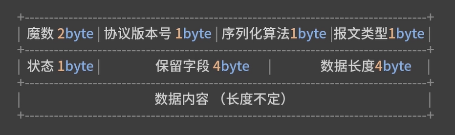
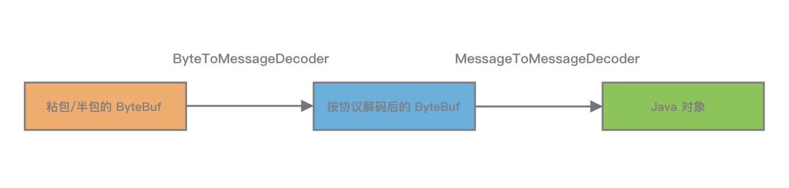
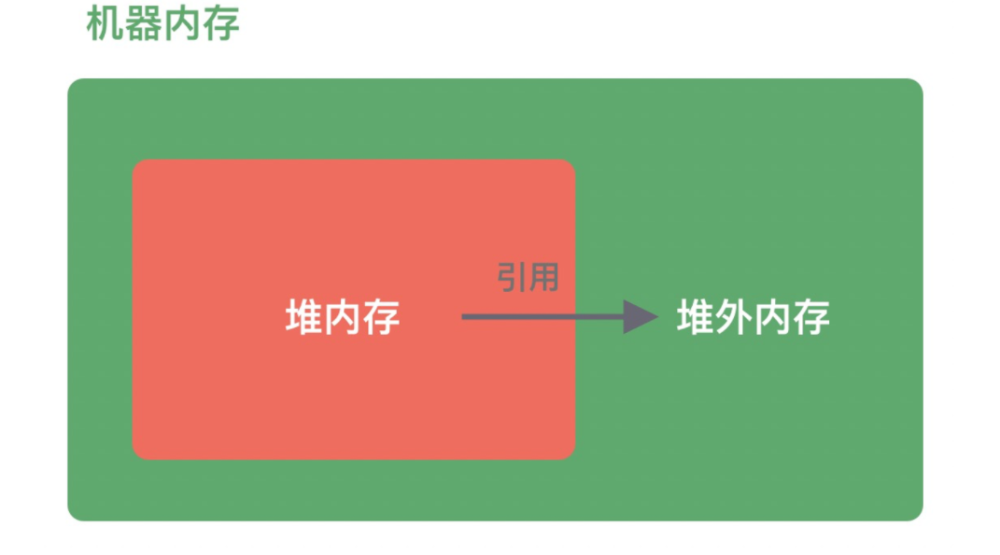
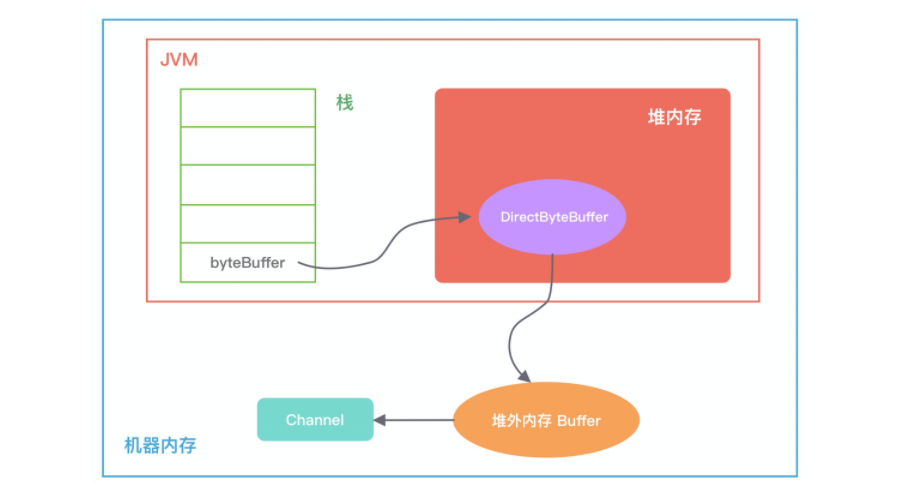

# Netty

为什么选择Netty?

* I/O 模型、线程模型和事件处理机制
* 易用性API接口
* 对数据协议、序列化的支持


**I/O 模型**

I/O 请求可以分为两个阶段，分别为调用阶段和执行阶段。

* 第一个阶段为I/O 调用阶段，即用户进程向内核发起系统调用。

* 第二个阶段为I/O 执行阶段。此时，内核等待 I/O 请求处理完成返回。该阶段分为两个过程：首先等待数据就绪，并写入内核缓冲区；随后将内核缓冲区数据拷贝至用户态缓冲区。


 **Linux 的 5 种主要 I/O 模式**

1.  同步阻塞 I/O（BIO）

   

   如上图所表现的那样，应用进程向内核发起 I/O 请求，发起调用的线程一直等待内核返回结果。一次完整的 I/O 请求称为BIO（Blocking IO，阻塞 I/O），所以 BIO 在实现异步操作时，只能使用多线程模型，一个请求对应一个线程。但是，线程的资源是有限且宝贵的，创建过多的线程会增加线程切换的开销。

2. 同步非阻塞 I/O（NIO）

   

   应用进程向内核发起 I/O 请求后不再会同步等待结果，而是会立即返回，通过轮询的方式获取请求结果。NIO 相比 BIO 虽然大幅提升了性能，但是轮询过程中大量的系统调用导致上下文切换开销很大。所以，单独使用非阻塞 I/O 时效率并不高，而且随着并发量的提升，非阻塞 I/O 会存在严重的性能浪费。

3. I/O 多路复用

   

   多路复用实现了一个线程处理多个 I/O 句柄的操作。多路指的是多个数据通道，复用指的是使用一个或多个固定线程来处理每一个 Socket。select、poll、epoll 都是 I/O 多路复用的具体实现，线程一次 select 调用可以获取内核态中多个数据通道的数据状态。多路复用解决了同步阻塞 I/O 和同步非阻塞 I/O 的问题，是一种非常高效的 I/O 模型。

4. 信号驱动 I/O

   

   信号驱动 I/O 并不常用，它是一种半异步的 I/O 模型。在使用信号驱动 I/O 时，当数据准备就绪后，内核通过发送一个 SIGIO 信号通知应用进程，应用进程就可以开始读取数据了。

5. 异步 I/O

   

   异步 I/O 最重要的一点是从内核缓冲区拷贝数据到用户态缓冲区的过程也是由系统异步完成，应用进程只需要在指定的数组中引用数据即可。

   > 异步 I/O 与信号驱动 I/O 这种半异步模式的主要区别：信号驱动 I/O 由内核通知何时可以开始一个 I/O 操作，而异步 I/O 由内核通知 I/O 操作何时已经完成。


Netty 的 I/O 模型是基于非阻塞 I/O 实现的，底层依赖的是 JDK NIO 框架的多路复用器 Selector。一个多路复用器 Selector 可以同时轮询多个 Channel，采用 epoll 模式后，只需要一个线程负责 Selector 的轮询，就可以接入成千上万的客户端。

## 传输

传输 API 的核心逻辑是 Channel，用于所有的 I/O 操作。每个Channel都会被分配一个 ChannelPipeline 和 ChannelConfig。

ChannelPipeline 持有所有将应用于入站和出栈数据以及事件的ChannelHandler 实例，这些 ChannelHandler 实现了应用程序用于处理状态变化以及数据处理的逻辑。

ChannelHandler 的典型用途：

* 将数据从一种格式转换为另一种格式
* 提供异常的通知
* 提供Channel 并为活动的或者非活动的通知
* 提供当Channel 注册到 EventLoop 或者从 EventLoop 注销时的通知
* 提供所有用户自定义事件的通知

### Netty 内置的传输

Netty 内置了一些可开箱即用的传输

* **NIO**：使用 java.nio.channels 包作为基础--基于选择器的方式
* **Epool**：由 JNI 驱动的epool() 和非阻塞 IO，这个传输支持只有在 Linux 上可用的多种特性，如 SO_REUSEPORT，比NIO传输更快，而且完全是非阻塞的。
* **OIO**：使用 Jave.net 包作为基础——使用阻塞流
* **Local**：可以在VM内部通过管道进行通信的本地传输
* **Embedded**：Embedded 传输，允许使用ChannelHander 而又不需要一个正真的基于网络的传输。在测试 ChannelHand而 实例时非常有用

#### NIO 非阻塞 I/O

NIO  提供了一个所以 I/O 操作的全异步的实现。它利用了基于选择器的 API。选择器背后的基本概念是充当一个注册表，在哪里你将可以请求在 Channel 的装填发生变化是得到通知。可能的状态变化有：

* 新的 Channel 已经接受并且就绪
* Channel 连接已经完成
* Channel 有已经就绪的可供读取的数据
* Channel 可用于写数据

选择器运行在一个检查状态变化并且对其做出相应响应的线程上，在应用程序对状态的改变做出响应后，选择器会被重置，并将重复这个过程。


### 通信协议

所谓协议，就是**通信双方事先商量好的接口暗语**。目前主流的**通用协议**(通信)如 HTTP、HTTPS、JSON-RPC、FTP、IMAP、Protobuf 等。**通用协议**兼容性好，易于维护，各种异构系统之间可以实现无缝对接。

如果通用协议不能满足业务场景，可以自定义通信协议，自定义通信协议有以下优点：

* **极致性能**：通用的通信协议考虑了很多兼容性的因素，必然在性能方面有所损失
* **扩展性**：自定义的协议相比通用协议更好扩展，可以更好地满足自己的业务需求。
* **安全性**：通用协议是公开的，自定义协议更加安全

一个完备的网络协议需具备的基本要素：



#### Netty 中的通信协议



### Netty 中支持的常用解码器

**固定长度解码器 FixedLengthFrameDecoder**

通过构造函数设置固定长度的大小 frameLength，无论接收方一次获取多大的数据，都会严格按照 frameLength 进行解码。通过构造函数设置固定长度的大小 frameLength，无论接收方一次获取多大的数据，都会严格按照 frameLength 进行解码。

* 构造器 
    ```java
    FixedLengthFrameDecoder(int frameLength)
    ```

**特殊分隔符解码器 DelimiterBasedFrameDecoder**

DelimiterBasedFrameDecoder 中的几个属性及作用

* **delimiters**：指定特殊分隔符，类型为 ByteBuf数组 的**入参**，可指定多个分割符，但最终会选择最短的分隔符进行拆分
* **maxLength**: 报文最大长度的限制。如果超过 maxLength 还没有检测到指定分隔符，将会抛出 TooLongFrameException
* **failFast**：failFast 与 maxLength 需要搭配使用，通过设置 failFast 可以控制抛出 TooLongFrameException 的时机，如果为 true 则立即抛出，否则当解码出一个完成的消息后抛出
* **stripDelimiter**：判断解码后得到的消息是否去除分隔符

------
* 构造器

    ```java
    DelimiterBasedFrameDecoder(
                int maxFrameLength, 
                boolean stripDelimiter, 
                boolean failFast, 
                ByteBuf... delimiters)
    ```

**长度域解码器 LengthFieldBasedFrameDecoder**

长度域解码器 LengthFieldBasedFrameDecoder 是解决 TCP 拆包/粘包问题最常用的**解码器**。

LengthFieldBasedFrameDecoder 包含的属性

* 长度域解码器特有属性

  ```java
  // 长度字段的偏移量，也就是存放长度数据的起始位置
  private final int lengthFieldOffset; 
  // 长度字段所占用的字节数
  private final int lengthFieldLength; 
  /* 消息长度的修正值
   *
   * 在很多较为复杂一些的协议设计中，长度域不仅仅包含消息的长度，而且包含其他的数据，如版本号、数据类型、数据状态等，那么这时候我们需要使用 lengthAdjustment 进行修正
   * 
   * lengthAdjustment = 包体的长度值 - 长度域的值
   */
  private final int lengthAdjustment; 
  // 解码后需要跳过的初始字节数，也就是消息内容字段的起始位置
  private final int initialBytesToStrip;
  // 长度字段结束的偏移量，lengthFieldEndOffset = lengthFieldOffset + lengthFieldLength
  private final int lengthFieldEndOffset;
  ```

* 固定长度解码器和特定分隔符解码器相似的属性

  ```java
  private final int maxFrameLength; // 报文最大限制长度
  private final boolean failFast; // 是否立即抛出 TooLongFrameException，与 maxFrameLength 搭配使用
  private boolean discardingTooLongFrame; // 是否处于丢弃模式
  private long tooLongFrameLength; // 需要丢弃的字节数
  private long bytesToDiscard; // 累计丢弃的字节数
  ```

------

* 构造器

  ```java
  public LengthFieldBasedFrameDecoder(
      ByteOrder byteOrder, 
      int maxFrameLength, 
      int lengthFieldOffset, 
      int lengthFieldLength,     
      int lengthAdjustment, 
      int initialBytesToStrip, 
      boolean failFast)
  ```


长度域解码器 示例

* 示例 1：典型的基于消息长度 + 消息内容的解码

  ```java
    BEFORE DECODE (14 bytes)         AFTER DECODE (14 bytes)
    +--------+----------------+      +--------+----------------+
    | Length | Actual Content |----->| Length | Actual Content |
    | 0x000C | "HELLO, WORLD" |      | 0x000C | "HELLO, WORLD" |
    +--------+----------------+      +--------+----------------+
        
  lengthFieldOffset = 0，因为 Length 字段就在报文的开始位置。
  lengthFieldLength = 2，协议设计的固定长度。
  lengthAdjustment = 0，Length 字段只包含消息长度，不需要做任何修正。
  initialBytesToStrip = 0，解码后内容依然是 Length + Content，不需要跳过任何初始字节。
  ```

* 示例 2：解码结果需要截断

  ```java
    BEFORE DECODE (14 bytes)         AFTER DECODE (12 bytes)
    +--------+----------------+      +----------------+
    | Length | Actual Content |----->| Actual Content |
    | 0x000C | "HELLO, WORLD" |      | "HELLO, WORLD" |
    +--------+----------------+      +----------------+
  
  lengthFieldOffset = 0，因为 Length 字段就在报文的开始位置。
  lengthFieldLength = 2，协议设计的固定长度。
  lengthAdjustment = 0，Length 字段只包含消息长度，不需要做任何修正。
  initialBytesToStrip = 2，跳过 Length 字段的字节长度，解码后 ByteBuf 中只包含 Content字段。
  ```

* 示例 3：长度字段包含消息长度和消息内容所占的字节

  ```java
  BEFORE DECODE (14 bytes)         AFTER DECODE (14 bytes)
  +--------+----------------+      +--------+----------------+
  | Length | Actual Content |----->| Length | Actual Content |
  | 0x000E | "HELLO, WORLD" |      | 0x000E | "HELLO, WORLD" |
  +--------+----------------+      +--------+----------------+
  lengthFieldOffset = 0，因为 Length 字段就在报文的开始位置。
  lengthFieldLength = 2，协议设计的固定长度。
  lengthAdjustment = -2，长度字段为 14 字节，需要减 2 才是拆包所需要的长度。
  initialBytesToStrip = 0，解码后内容依然是 Length + Content，不需要跳过任何初始字节。
  ```

  > 与前两个示例不同的是，示例 3 的 Length 字段包含 Length 字段自身的固定长度以及 Content 字段所占用的字节数，Length 的值为 0x000E（2 + 12 = 14 字节），在 Length 字段值（14 字节）的基础上做 lengthAdjustment（-2）的修正，才能得到真实的 Content 字段长度

* 示例 4：基于长度字段偏移的解码

  ```java
  BEFORE DECODE (17 bytes)                      AFTER DECODE (17 bytes)
  +----------+----------+----------------+      +----------+----------+----------------+
  | Header 1 |  Length  | Actual Content |----->| Header 1 |  Length  | Actual Content |
  |  0xCAFE  | 0x00000C | "HELLO, WORLD" |      |  0xCAFE  | 0x00000C | "HELLO, WORLD" |
  +----------+----------+----------------+      +----------+----------+----------------+
  lengthFieldOffset = 2，需要跳过 Header 1 所占用的 2 字节，才是 Length 的起始位置。
  lengthFieldLength = 3，协议设计的固定长度。
  lengthAdjustment = 0，Length 字段只包含消息长度，不需要做任何修正。
  initialBytesToStrip = 0，解码后内容依然是完整的报文，不需要跳过任何初始字节。
  ```

  Length 字段不再是报文的起始位置，Length 字段的值为 0x00000C，表示 Content 字段占用 12 字节

* 示例 5：长度字段与内容字段不再相邻

  ```java
  BEFORE DECODE (17 bytes)                      AFTER DECODE (17 bytes)
  +----------+----------+----------------+      +----------+----------+----------------+
  |  Length  | Header 1 | Actual Content |----->|  Length  | Header 1 | Actual Content |
  | 0x00000C |  0xCAFE  | "HELLO, WORLD" |      | 0x00000C |  0xCAFE  | "HELLO, WORLD" |
  +----------+----------+----------------+      +----------+----------+----------------+
  lengthFieldOffset = 0，因为 Length 字段就在报文的开始位置。
  lengthFieldLength = 3，协议设计的固定长度。
  lengthAdjustment = 2，由于 Header + Content 一共占用 2 + 12 = 14 字节，所以 Length 字段值（12 字节）加上 lengthAdjustment（2 字节）才能得到 Header + Content 的内容（14 字节）。
  initialBytesToStrip = 0，解码后内容依然是完整的报文，不需要跳过任何初始字节
  ```

  > Length 字段之后是 Header 1，Length 与 Content 字段不再相邻。Length 字段所表示的内容略过了 Header 1 字段，所以也需要通过 lengthAdjustment 修正才能得到 Header + Content 的内容

* 示例 6：基于长度偏移和长度修正的解码

  ```java
  BEFORE DECODE (16 bytes)                       AFTER DECODE (13 bytes)
  +------+--------+------+----------------+      +------+----------------+
  | HDR1 | Length | HDR2 | Actual Content |----->| HDR2 | Actual Content |
  | 0xCA | 0x000C | 0xFE | "HELLO, WORLD" |      | 0xFE | "HELLO, WORLD" |
  +------+--------+------+----------------+      +------+----------------+
  lengthFieldOffset = 1，需要跳过 HDR1 所占用的 1 字节，才是 Length 的起始位置。
  lengthFieldLength = 2，协议设计的固定长度。
  lengthAdjustment = 1，由于 HDR2 + Content 一共占用 1 + 12 = 13 字节，所以 Length 字段值（12 字节）加上 lengthAdjustment（1）才能得到 HDR2 + Content 的内容（13 字节）。
  initialBytesToStrip = 3，解码后跳过 HDR1 和 Length 字段，共占用 3 字节。
  ```

* 示例 7：长度字段包含除 Content 外的多个其他字段

  ```java
  BEFORE DECODE (16 bytes)                       AFTER DECODE (13 bytes)
  +------+--------+------+----------------+      +------+----------------+
  | HDR1 | Length | HDR2 | Actual Content |----->| HDR2 | Actual Content |
  | 0xCA | 0x0010 | 0xFE | "HELLO, WORLD" |      | 0xFE | "HELLO, WORLD" |
  +------+--------+------+----------------+      +------+----------------+
  lengthFieldOffset = 1，需要跳过 HDR1 所占用的 1 字节，才是 Length 的起始位置。
  lengthFieldLength = 2，协议设计的固定长度。
  lengthAdjustment = -3，Length 字段值（16 字节）需要减去 HDR1（1 字节） 和 Length 自身所占字节长度（2 字节）才能得到 HDR2 和 Content 的内容（1 + 12 = 13 字节）。
  initialBytesToStrip = 3，解码后跳过 HDR1 和 Length 字段，共占用 3 字节。
  ```

  > 示例 7 与 示例 6 的区别在于 Length 字段记录了整个报文的长度，包含 Length 自身所占字节、HDR1 、HDR2 以及 Content 字段的长度，解码器需要知道如何进行 lengthAdjustment 调整，才能得到 HDR2 和 Content 的内容

## Buffer  与 内存管理

### Java 堆外内存

**Java 堆外内存**：在使用 Netty 时，需要时刻与堆外内存打交道，堆外内存使用不当会使得应用出错、崩溃的概率变大，所以在使用堆外内存时一定要慎重。

在 Java 中对象都是在堆内分配的，通常我们说的**JVM 内存**也就指的**堆内内存**，**堆内内存**完全被**JVM 虚拟机**所管理，JVM 有自己的垃圾回收算法，对于使用者来说不必关心对象的内存如何回收。

**堆外内存**与堆内内存相对应，对于整个机器内存而言，除**堆内内存以外部分即为堆外内存**，如下图所示。堆外内存不受 JVM 虚拟机管理，直接由操作系统管理。



堆外内存和堆内内存的利弊

1. 堆内内存由 JVM GC 自动回收内存，降低了 Java 用户的使用心智，但是 GC 是需要时间开销成本的，堆外内存由于不受 JVM 管理，所以在一定程度上可以降低 GC 对应用运行时带来的影响。
2. 堆外内存需要手动释放，这一点跟 C/C++ 很像，稍有不慎就会造成应用程序内存泄漏，当出现内存泄漏问题时排查起来会相对困难。
3. 当进行网络 I/O 操作、文件读写时，堆内内存都需要转换为堆外内存，然后再与底层设备进行交互，这一点在介绍 writeAndFlush 的工作原理中也有提到，所以直接使用堆外内存可以减少一次内存拷贝。
4. 堆外内存可以实现进程之间、JVM 多实例之间的数据共享。

#### 堆外内存的分配

Java 中堆外内存的分配方式有两种：**ByteBuffer#allocateDirect**和**Unsafe#allocateMemory**

* 方式一： Java NIO 包中的 ByteBuffer 类的分配方式 **ByteBuffer#allocateDirect**

  ```java
  // 分配 10M 堆外内存
  ByteBuffer buffer = ByteBuffer.allocateDirect(10 * 1024 * 1024); 
  ```

  跟进 ByteBuffer.allocateDirect 源码，发现其中直接调用的 DirectByteBuffer 构造函数：

  ```java
  DirectByteBuffer(int cap) {
      super(-1, 0, cap, cap);
      boolean pa = VM.isDirectMemoryPageAligned();
      int ps = Bits.pageSize();
      long size = Math.max(1L, (long)cap + (pa ? ps : 0));
      Bits.reserveMemory(size, cap);
      long base = 0;
      try {
          base = unsafe.allocateMemory(size);
      } catch (OutOfMemoryError x) {
          Bits.unreserveMemory(size, cap);
          throw x;
      }
      unsafe.setMemory(base, size, (byte) 0);
      if (pa && (base % ps != 0)) {
          address = base + ps - (base & (ps - 1));
      } else {
          address = base;
      }
      cleaner = Cleaner.create(this, new Deallocator(base, size, cap));
      att = null;
  }
  ```

  在堆内存放的 DirectByteBuffer 对象并不大，仅仅包含堆外内存的地址、大小等属性，同时还会创建对应的 Cleaner 对象，通过 ByteBuffer 分配的堆外内存不需要手动回收，它可以被 JVM 自动回收。当堆内的 DirectByteBuffer 对象被 GC 回收时，Cleaner 就会用于回收对应的堆外内存。

  

  从 DirectByteBuffer 的构造函数中可以看出，真正分配堆外内存的逻辑还是通过 unsafe.allocateMemory(size)

* 方法二：通过 Unsafe#allocateMemory 分配堆外内存

  Unsafe 是一个非常不安全的类，它用于执行内存访问、分配、修改等敏感操作，可以越过 JVM 限制的加锁。Unsafe 最初并不是为开发者设计的，使用它时虽然可以获取对底层资源的控制权，但也失去了安全性的保证，所以使用 Unsafe 一定要慎重。

  在Java 中是不能直接使用 Unsafe 类的，但是可以通过反射获取 Unsafe 实例，使用方法如下

  ```java
  private static Unsafe unsafe = null;
  static {
      try {
          Field getUnsafe = Unsafe.class.getDeclaredField("theUnsafe");
          getUnsafe.setAccessible(true);
          unsafe = (Unsafe) getUnsafe.get(null);
      } catch (NoSuchFieldException | IllegalAccessException e) {
          e.printStackTrace();
      }
  }
  ```

  获得 Unsafe 实例后，我们可以通过 allocateMemory 方法分配堆外内存，allocateMemory 方法返回的是内存地址，使用方法如下所示：

  ```java
  // 分配 10M 堆外内存
  long address = unsafe.allocateMemory(10 * 1024 * 1024);
  ```

  Unsafe#allocateMemory 所分配的内存必须自己手动释放，否则会造成内存泄漏，这也是 Unsafe 不安全的体现。Unsafe 同样提供了内存释放的操作：

  ```java
  unsafe.freeMemory(address);
  ```

#### 堆外内存的回收

 DirectByteBuffer 对象有可能长时间存在于堆内内存，所以它很可能晋升到 JVM 的老年代，所以这时候 DirectByteBuffer 对象的回收需要依赖 Old GC 或者 Full GC 才能触发清理。如果长时间没有 Old GC 或者 Full GC 执行，那么堆外内存即使不再使用，也会一直在占用内存不释放，很容易将机器的物理内存耗尽。

在使用 DirectByteBuffer 时，最好通过 JVM 参数 ` -XX:MaxDirectMemorySize` 定堆外内存的上限大小，当堆外内存的大小超过该阈值时，就会触发一次 Full GC 进行清理回收，如果在 Full GC 之后还是无法满足堆外内存的分配，那么程序将会抛出 OOM 异常。

> 在 ByteBuffer.allocateDirect 分配的过程中，如果没有足够的空间分配堆外内存，在 Bits.reserveMemory 方法中也会主动调用 System.gc() 强制执行 Full GC，但是在生产环境一般都是设置了 -XX:+DisableExplicitGC，System.gc() 是不起作用的

