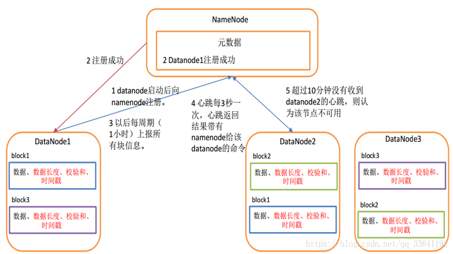

[toc]

# HDFS 

HDFS 的源码结构，HDFS 的源代码都在 com.apache.hadoop 包下，其结构如图，

主要可分为4类：

* **基础包**：基础工具和安全包，其中 hdfs.util 包含一些HDFS实现需要的辅助数据结构；hdfs.security.token.block 和 hdfs.security.token.delegation 结构 Hadoop 的安全框架，提供安全访问 HDFS 的机制，集成了企业广泛应用的 Kerberos 标准。
* **HDFS 实体实现包**：
* **应用包**：hdsfs.tools，hdfs.server.balancer，提供查询 HDFS 状态信息工具 dfsadmin、文件系统检查工具 fsck 和 HDFS 均衡器 balancer（通过 start-balancer.sh 启动）的实现。
* **WebHDFS 相关包**：

HDFS 中几个重要的接口：

客户端接口

* ClientProtocol：客户端与 NameNode，HDFS 客户端访问文件系统的入口
* ClientDatanodeProtocol：客户端与 DataNode 的接口，用于客户端和数据节点进行交互

服务端接口：

* DataNodeProtocol：DataNode 与 NameNode 节点间的接口，

* InterDatanodeProtocol：DataNode 与 DataNode 节点间的接口。DataNode 通过这个接口，和其他 DataNode 节点进行通信，恢复数据块，保证数据的一致性。

* NamenodeProtocol：SecondaryNameNode、HDFS balancer 与 NameNode 节点间的接口。SecondaryNameNode 会不停的获取 NameNode 及节点上某一时间点的 Fsimage(镜像文件) 和  Edits(编辑日志)，然后合并成一个新的 Fsimage，并将结果发送回 NameNode 节点，这个过程中会使用该接口，配置 SecondaryNameNode 完成 元数据的合并。该接口也为 HDFS 的均衡器 balancer 的正常工作提供了一些信息。

  > **Fsimage 文件（镜像文件）**：HDFS 文件系统元数据的一个永久性的检查点，包含 HFDS 文件系统的所有目录和文件 idnode  的序列化信息
  >
  > **Edits 文件（编辑日志）**：存放HDFS文件的所有更新操，文件系统客户端执行所有的更新操作，首先会被记录到 edits 文件中。

**Block**：HDFS 每个块的大小，类似磁盘块

**Packet**：Packet 是第二大单位，它是client 向 DataNode (DataNode 的 PIPLine 之间传输数据的基本单位)

**Chunk**：chunk 是最小的单位，它是Client向DataNode（DataNode的 PipLine 之间进行数据校验的基本单位，默认 512Byte，因为做校验，每个 chunk 需带有4Byte 的校验位。所以实际每个 chunk 写入Packet 的实际大小为516Byte。

> 真实数据与校验数据的比值约为 128 ：1，（即 64 * 1024/512)

在client端向DataNode传数据的时候，HDFSOutputStream会有一个chunk buff，写满一个chunk后，会计算校验和并写入当前的chunk。之后再把带有校验和的chunk buff写入packet，当一个packet写满后，packet会进入dataQueue队列，其他的DataNode就是从这个dataQueue获取client端上传的数据并存储的。同时一个DataNode成功存储一个packet后之后会返回一个ack packet，放入ack Queue中。

## 主要流程

主要流程涉及到的主要接口

**1、客户端相关的接口**

* ClientProtocol：Client 与 NameNode 的RPC接口，是 HDFS Client 访问文件系统的入口，Client 通过这个接口访问 NameNode，操作文件或目录的元数据信息，读写文件必选先访问 NameNode，接下来再和DataNode交互，操作文件数据。Client 通过这个接口还能从 NameNode 获取 分布式文件系统的一些整体运行状态。

  > 类似于 FAT文件系统中，读取文件必须先访问 FAT(文件分配表)，然后访问在磁盘访问具体的磁盘块 ，进行IO操作。
  >
  > FAT  -->> NameNode , 磁盘 -->>  DataNode,  磁盘块 -->> HDFS 中的Block

  主要提供的两大类的功能：

  * 用于实现 Hadoop 文件系统相关的功能
  * 用于对 HDFS 状态进行查询、设置的能力

* ClientDatanodeProtocol：Client 与 DataNode 的接口，用户 Client 和 DataNode 节点进行交互，Client 和 DataNode 节点间的主要交互是通过流接口进行读/写文件数据的操作。

  ClientDatanodeProtocol 主要涉及三个方法

  * recoverBlock() 方法，客户端往数据节点写数据的过程中，如果某个副本所在的数据节点出现错误，客户端会尝试调用 recoverBlock() 进行数据块恢复
  * getBlockInfo() 方法，返回数据节点上指定数据块的信息，
  * getBlockLocalPathInfo() 方法，BlockLocalPathInfo 类应用于本地优化，执行本地读的客户端通过该方法，获得某个数据块对应的数据块文件及数据块校验信息文件的本地路径(文件描述符)，然后直接从本地文件系统读取文件。

**2、服务间的接口**

* DataNodeProtocol：DataNode 与 NameNode 之间的接口，在 HDFS 主从体系结构中，从节点 DataNode 不断地通过这个接口向主节点 NameNode 汇报一些信息，同步到 NameNode 节点；同时，该接口的一些方法的返回值会带回 NameNode 节点的指令，DataNode 根据这些指令，或移动、或删除、或恢复本地磁盘上的数据块，或执行一些其他操作。
* InterDataNodeProtocol：DataNode 与 DataNode 节点间的接口，DataNode 与 DataNode 间通过这个接口进通信，以恢复数据块，保证数据的一致性。
* NamenodeProtocol：secondary NameNode 、HDFS Balancer 与 NameNode 节点间的接口，Secondary NameNode 会不停地获取 NameNode 节点上某一时间点的 FSImage 和 Edits log，然后合并成一个新的 FSImage，并返回给 NameNode。
* 

### DataNode 的启动和心跳

