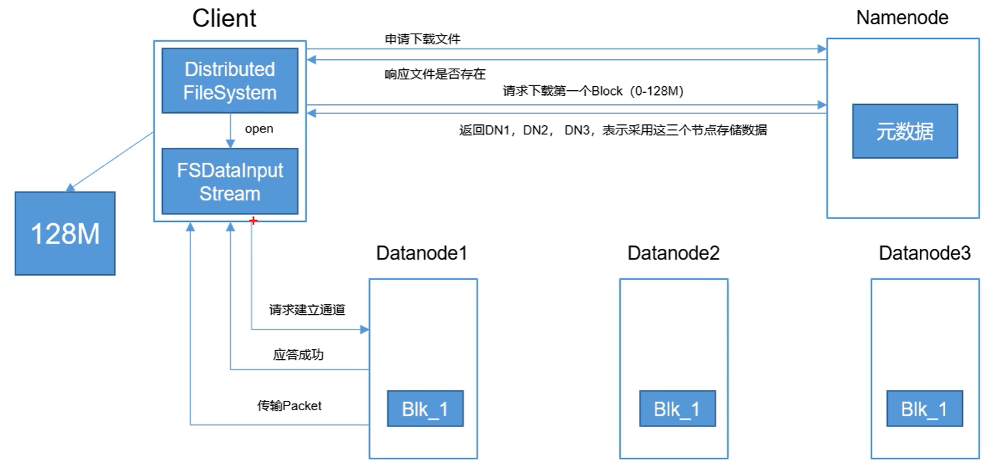

[toc]

# HDFS 

## HDFS 概述

HDFS 的源码结构，HDFS 的源代码都在 com.apache.hadoop 包下，其结构如图，

主要可分为4类：

* **基础包**：基础工具和安全包，其中 hdfs.util 包含一些HDFS实现需要的辅助数据结构；hdfs.security.token.block 和 hdfs.security.token.delegation 结构 Hadoop 的安全框架，提供安全访问 HDFS 的机制，集成了企业广泛应用的 Kerberos 标准。
* **HDFS 实体实现包**：
* **应用包**：hdsfs.tools，hdfs.server.balancer，提供查询 HDFS 状态信息工具 dfsadmin、文件系统检查工具 fsck 和 HDFS 均衡器 balancer（通过 start-balancer.sh 启动）的实现。
* **WebHDFS 相关包**：

HDFS 中几个重要的接口：

客户端接口

* ClientProtocol：客户端与 NameNode，HDFS 客户端访问文件系统的入口
* ClientDatanodeProtocol：客户端与 DataNode 的接口，用于客户端和数据节点进行交互

服务端接口：

* DataNodeProtocol：DataNode 与 NameNode 节点间的接口，

* InterDatanodeProtocol：DataNode 与 DataNode 节点间的接口。DataNode 通过这个接口，和其他 DataNode 节点进行通信，恢复数据块，保证数据的一致性。

* NamenodeProtocol：SecondaryNameNode、HDFS balancer 与 NameNode 节点间的接口。SecondaryNameNode 会不停的获取 NameNode 及节点上某一时间点的 Fsimage(镜像文件) 和  Edits(编辑日志)，然后合并成一个新的 Fsimage，并将结果发送回 NameNode 节点，这个过程中会使用该接口，配置 SecondaryNameNode 完成 元数据的合并。该接口也为 HDFS 的均衡器 balancer 的正常工作提供了一些信息。

  > **Fsimage 文件（镜像文件）**：HDFS 文件系统元数据的一个永久性的检查点，包含 HFDS 文件系统的所有目录和文件 idnode  的序列化信息
  >
  > **Edits 文件（编辑日志）**：存放HDFS文件的所有更新操，文件系统客户端执行所有的更新操作，首先会被记录到 edits 文件中。

**Block**：HDFS 每个块的大小，类似磁盘块

**Packet**：Packet 是第二大单位，它是client 向 DataNode (DataNode 的 PIPLine 之间传输数据的基本单位)

**Chunk**：chunk 是最小的单位，它是Client向DataNode（DataNode的 PipLine 之间进行数据校验的基本单位，默认 512Byte，因为做校验，每个 chunk 需带有4Byte 的校验位。所以实际每个 chunk 写入Packet 的实际大小为516Byte。

> 真实数据与校验数据的比值约为 128 ：1，（即 64 * 1024/512)

在client端向DataNode传数据的时候，HDFSOutputStream会有一个chunk buff，写满一个chunk后，会计算校验和并写入当前的chunk。之后再把带有校验和的chunk buff写入packet，当一个packet写满后，packet会进入dataQueue队列，其他的DataNode就是从这个dataQueue获取client端上传的数据并存储的。同时一个DataNode成功存储一个packet后之后会返回一个ack packet，放入ack Queue中。

## 主要流程

HDFS  是采用了多项分布式技术实现文件系统，HDFS 各个实体间存在着多种信息交互的过程，这些交互有些使用 Hadoop IPC  调用实现，充分利用 IPC 机制特有的，和本地过程调用相同的语法外观，在需要交换大量数据的场景中，则使用基于 TCP 或者基于 HTTP 的流式接口。HDFS 各个实体间的联系

### 主要接口概述

**1、客户端相关的接口**

* **ClientProtocol**：Client 与 NameNode 的RPC接口，是 HDFS Client 访问文件系统的入口，Client 通过这个接口访问 NameNode，操作文件或目录的元数据信息，读写文件必选先访问 NameNode，接下来再和DataNode交互，操作文件数据。Client 通过这个接口还能从 NameNode 获取 分布式文件系统的一些整体运行状态。

  > 类似于 FAT文件系统中，读取文件必须先访问 FAT(文件分配表)，然后访问在磁盘访问具体的磁盘块 ，进行IO操作。
  >
  > FAT  -->> NameNode , 磁盘 -->>  DataNode,  磁盘块 -->> HDFS 中的Block

  主要提供的两大类的功能：

  * 用于实现 Hadoop 文件系统相关的功能
  * 用于对 HDFS 状态进行查询、设置的能力

* ClientDatanodeProtocol：Client 与 DataNode 的接口，用户 Client 和 DataNode 节点进行交互，Client 和 DataNode 节点间的主要交互是通过流接口进行读/写文件数据的操作。

  ClientDatanodeProtocol 主要涉及三个方法

  * recoverBlock() 方法，客户端往数据节点写数据的过程中，如果某个副本所在的数据节点出现错误，客户端会尝试调用 recoverBlock() 进行数据块恢复
  * getBlockInfo() 方法，返回数据节点上指定数据块的信息，
  * getBlockLocalPathInfo() 方法，BlockLocalPathInfo 类应用于本地优化，执行本地读的客户端通过该方法，获得某个数据块对应的数据块文件及数据块校验信息文件的本地路径(文件描述符)，然后直接从本地文件系统读取文件。

**2、服务间的接口**

* **DataNodeProtocol**：DataNode 与 NameNode 之间的接口，在 HDFS 主从体系结构中，从节点 DataNode 不断地通过这个接口向主节点 NameNode 汇报一些信息，同步到 NameNode 节点；同时，该接口的一些方法的返回值会带回 NameNode 节点的指令，DataNode 根据这些指令，或移动、或删除、或恢复本地磁盘上的数据块，或执行一些其他操作。

  * 握手、注册、块汇报和心跳

    DataNode 启动时，会使用 DataNodeProtocol 的方法 versionRequet() 和 NameNode节点进行握手，其返回值为 NamespaceInfo。

    握手之后，数据节点通过 RPC 方法 DatanodeProtocol.register() 向NameNode 注册，该方法参数是一个 DatanodeRegistration 对象，NameNode 的返回值也是一个 DatanodeRegistration 对象。

    > DatanodeRegistration：提供了进行注册的 Datanode 节点的节点标DatanodeID 和 存储信息 StorageInfo

    注册成功后，Datanode 通过 DatanodeProtocol 中的 blockReport() 成员方法，上报它所管理的全部的 block 信息，帮助NameNode 建立 block 和  Datanode 节点的映射关系。该方法携带该节点的信息（HAdoop IPC 不支持会话，Datanode 调用 NameNode 的 RPC 方法时，需提供自己的身份）及所上报的block信息，该方法返回值是 DatanodeCommand 对象。块汇报一般只在Datanode 启动的时候发生。

    Datanode 通过sendHeartbeat() 向 NameNode发送心跳，该方法处理携带身份标识 DatanodeRegistration 外，还包括DataNode 当前运行情况的信息(包括 DataNode 容量、已使用容量、剩余容量、正在写文件数据的连接数、读写数据使用的线程数等)，这些信息基本概况了 DataNode 节点的负载情况。sendHeartbeat() 返回值包含一个 DataNodeCommand数组，带回一些列 NameNode 的指令。

    握手、注册、块汇报一般在Datanode启动时发生，而心跳则伴随着Datanode的启动一直进行。

  * NameNode 指令 (DataNodeCommand)

    blockReport() 和 sendHeartbeat() 的返回值 都和 DatanodeCommand有关，DataNodeCommand 是所有 NameNode 对 Datanode 指令的基类，它有以下实现类，代表类型不同的操作，

    

  * 块汇报相关的其他方法：

    **reportBadBlocks()**：数据块保存在 Datanode上，在分布式环境中，可能由于各种原因，会产生 block 损坏的情况。HDFS 使用循环冗余校验(CRC-32) 进行错误检测。HDFS 会在 3 中情况下检验校验和，分别是 Datanode 接收数据后，存储出数据前；（某些情况下）客户端读取Datanode 数据节点上的数据时；Datanode 节点上的 DataBlockScanner 扫描线程定期扫描 block。当发现block 有问题时，也就是校验出错时，就会通过 reportBadBlocks() 上报给NameNode。

    **blockReceived()**：向 NameNode 汇报它已经完整地接收了一些数据块(可以理解为数据块已经成功写入该Datanode节点)，接收的来源可以是客户端、其他Datanode节点及Balancer 触发的数据块复制。

* InterDataNodeProtocol：DataNode 与 DataNode 节点间的接口，DataNode 与 DataNode 间通过这个接口进通信，以恢复数据块，保证数据的一致性。

* NamenodeProtocol：secondary NameNode 、HDFS Balancer 与 NameNode 节点间的接口，Secondary NameNode 会不停地获取 NameNode 节点上某一时间点的 FSImage 和 Edits log，然后合并成一个新的 FSImage，并返回给 NameNode。

### 主要流程

Client 通过RPC 请求可操作 NameNode 节点的元数据，如更改文件名(rename)、在给定目录下创建一个子目录(mkdir）等，

#### 创建目录

客户端调用 HDFS 的 FileSystem 实例(DistriburedFileSystem) 的 mkdir  方法时，如图步骤1，DistributedFileSystem 对象通过 IPC 调用 NameNode 节点上的 RPC 方法 mkdir()，让NameNode 节点执行具体的创建子目录操作：在目录树数据机构上的对应位置创建新的目录节点，同时记录这个操作，并持久化到 Edit log 中，方法执行成功后，返回true，结束创建过程。期间，Client 和 NameNode 都不需要与 Datanode 交互。

其他一些复杂的操作，如果设置文件副本数`DistributedFileSystem.setREplication()`,删除HDFS 上的文件 `DistributedFileSystem.delete()`，都需要Datanode节点配合执行。

#### 删除文件

如图所示，删除 HDFS 上的文件时，与创建文件类似，delete 操作也会记录到 Edits log中，操作在NameNode节点上执行完毕后，DataNode 节点上存放文件内容的数据块也必须删除。但 NameNode 在收到 delete 操作后，不会主动去联系 delete 文件block所在的 Datanode节点，立即删除数据，而只是标记涉及需要别删除的block。当保存着要删除数据块的 Datanode 向 NameNode 发送心跳时，如图 步骤3，NameNode 节点会通过 DatanodeCommand 命令数据节点删除 block。

> 注意：被删除文件的数据块，在删除操作完成后一段时间以后，才会被真正删除；NameNode 和 Datanode 节点永远维持着简单的主从关系，NameNode 不会向 Datanode 节点发起任何 RPC 调用。

#### 读流程

客户端通过 FileSystem.open() 打开文件，对应的 HDFS  具体文件系统，DistributedFileSystem 创建输出流 FSDataInputStream，返回给客户端，客户端使用这个输入流读取数据。

#### 写流程

#### DataNode 的启动和心跳

#### SecondoryNode 节点合并数据

## DataNode 实现

