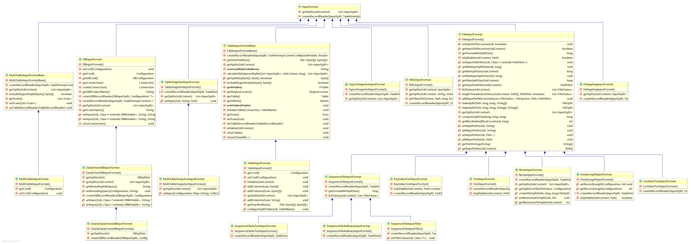

# MapReduce InputFormat

## MapReduce中的InputFormat类型

### **InputFormat**



从InputFormat类图看，InputFormat抽象类仅有两个抽象方法：

* List<InputSplit> getSplits()：根据输入文件计算出输入切片(InputSplit)，解决输入文件切片问题
* RecordReader<K,V> createRecordReader()：创建 ResordReader,从 InputSplit 中读取数据，解决从切片中读取数据的问题

在 调用 getSplits() 获取切片时，还会验证输入文件是否可分割、文件存储时分块的大小和文件大小等因素。此外切片是按输入文件 逻辑切片，而输入文件不会被物理分割成块。每个切片都是一个`<input-file-path,start,offset>`的元组。

Map 任务把输入分片传递给 InputFotmat 的 createRecordReader()方法来获得这个切片的RecordReader。RecordReader 类似迭代器，map 任务用一个 RecordReader 来生成记录的键-值对，然后再传递给 map 函数。从 Mapper 的 run() 方法中可以看到这块逻辑：

> 运行 setup() 之后，再重复调用 Context 上的 nextKeyValue()(委托给 RecorReader 的同名的方法) 为 map 产生 键-值对象。通过 Content， 键/值 从 RecordReader 中检索出并传递给 map()　方法。当reader 读到 stream 的结尾时，nextKeyValue() 方法返回 false, map 任务运行其 cleanup() 方法，然后结束。

```java
  public void run(Context context) throws IOException, InterruptedException {
    setup(context);
    try {
      while (context.nextKeyValue()) {
        map(context.getCurrentKey(), context.getCurrentValue(), context);
      }
    } finally {
      cleanup(context);
    }
  }
```

## FileInputFormat

FileInputFormat 是所有基于文件的InputFormat的基类，指定数据文件所在的输入目录（或文件，输入既可以指定为目录，也可以指定为文件）。 FileInputFormat将读取所有文件并将这些文件分成一个或多个InputSplits。

FileInputFormat 分片大小的计算公式：

```java
max(minSize, Math.min(maxSize, blockSize))
```

在默认情况下：minSize < blockSize < maxSize

### CombineFileInputFormat 

CombineFileInputFormat  是针对小文件而设计的，根据一定的规则，将HDFS上多个小文件合并到一个 `InputSplit`中，然后会启用一个Map来处理这里面的文件，以此减少MR整体作业的运行时间。对于那些块放到同一个分片中，CombileFileInputFormat 会考虑节点和机架的因素，所以在典型的 MapReduce 作业处输入的速度并不会下降。

**切片逻辑：**

将输入目录下所有文件大小，依次和设置的setMaxInputSplitSize 值比较，如果不大于设置的最大值，逻辑上划分一个块。如果输入文件大于设置的最大值且大于两倍，那么以最大值切割一块；当剩余数据大小超过设置的最大值且不大于最大值2 倍，此时将文件均分成2 个虚拟存储块（防止出现太小切片）。

> CombineFileInputFormat 为抽象类，使用时要用其子类

* CombineTextInputFormat
* CombineSequenceFileInputFormat
* WholeFileInputFormat

> 参考：
> https://www.iteblog.com/archives/2139.html
>  https://www.iteblog.com/archives/978.html

###  TextInputFormat:dart:

TextInputFormat 是MapReduce的默认InputFormat。TextInputFormat将每个输入文件的每一行视为单独的记录，并不执行分析。对于未格式化的数据或基于行的记录（如日志文件）非常有用。

* Key  - 是文件内行开头的字节偏移量（不是整个文件只是一个inputsplit），因此如果与文件名一起使用，它将是唯一的。
* Value – 是该行的内容，不包括行结束符

TextInputFormat切片 机制是 对 任务按文件规划切片 不管文件多小 都会是一个单独的切 片 都会交给一个 MapTask 这样如果有大量小文件 就 会 产生大量的MapTask 处理效率极其低下。

### NLineInputFormat

NLineInputFormat是TextInputFormat的另一种形式，将 N 行作业一个切分 split，默认情况下 N = 1，即输入文件中的每行起一个Mapper来处理，

* Key - 行的字节偏移量
* Value - 行的内容。

可通过配置 mapreduce.input.lineinputformat.linespermap 指定 N 值，

### KeyValueTextInputFormat

KeyValueTextInputFormat 与TextInputFormat类似，它也将每行输入视为单独的记录，但KeyValueTextInputFormat通过制表符`/t`将行本身分解为键和值。

* Key -  行首直到制表符
* 制表符后的行剩余部分

可通过 mapreduce.input.keyvaluelinerecordreader.key.value.separator 配置自定义分割符，

### SequenceFileInputFormat

SequenceFileInputFormat是一个读取序列文件的InputFormat。序列文件是存储二进制键值对序列的二进制文件，序列文件是块压缩的，并提供几种任意数据类型（不仅仅是文本）的直接序列化和反序列化

键和值都是用户自定义的

#### SequenceFileAsTextInputFormat

SequenceFileAsTextInputFormat 是 SequenceFileInputFormat 的另一种形式，它将序列文件键值转换为Text对象，通过调用`tostring()`转换是在键和值上执行的，这个InputFormat使序列文件适合输入流。

### FixedLengthInputFormat

FixedLengthInputFormat 用于从文件中读取固定宽度的二进制记录，这些记录没有用分隔符分开，必须通过 fixedlengthinputformat.record.length 设置每个记录的大小。

## DBInputFormat

 DBInputFormat 使用JDBC从关系数据库中读取数据。


**参考链接**：

* [Hadoop InputFormat介绍](https://www.jianshu.com/p/12c66b6f5c57)